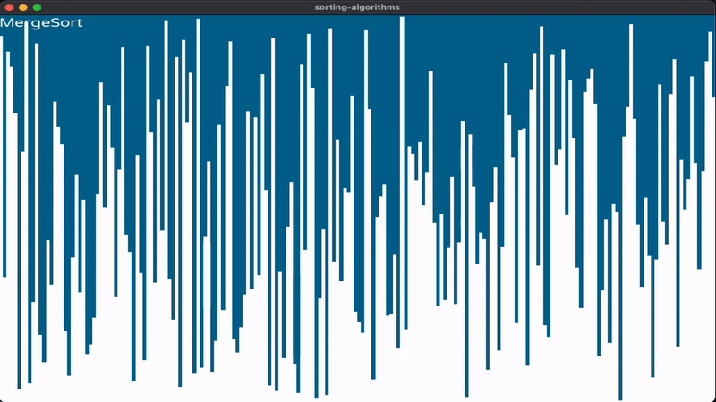

# sorting-algorithm-visualization
## About the Project 📋

This project is a sorting visualization application implemented in C++ using the SFML library. It provides a visual representation of various sorting algorithms such as Bubble Sort, Merge Sort, Quick Sort, and more. Users can interact with the application to see how these algorithms work on randomized input data.

<div align="center">
  
</div>

### Implemented Algorithms 🧮
- Mergesort
- Quicksort
- Bubblesort
- Minsort
- Maxsort
- Swapsort

### Key Features 🔑

- Visualization of sorting algorithms.
- User-friendly interface for selecting algorithms and controlling the visualization.
- Educational tool for understanding sorting algorithms.

## Getting Started 🛠

Follow the steps below to get a local copy of the project up and running on your machine.

### Prerequisites 📚

Before you begin, make sure you have the following tools and libraries installed:

- C++ compiler (e.g., g++)
- SFML library <3
- Google Test (for running tests)

### Installation with make 🔧

#### Edit the Makefile
Before building the project, you'll need to edit the Makefile to specify the correct paths for the SFML library and include directories based on your system. Open the Makefile in a text editor and update the following lines:

 ```js
	CXX = g++
	CXXFLAGS = -I/yourpath/sorting-algorithm-visualization/sfml/include -std=c++11
	LDFLAGS = -L/yourpath/sorting-algorithm-visualization/sfml/lib
	LIBS = -lsfml-graphics -lsfml-window -lsfml-system -Wl,-rpath,./sfml/lib/
 ```
Replace "yourpath" with your own path.

1. Clone the repository:
	```shell
	git clone https://github.com/raphsenn/sorting-algorithm-visualization.git
2. Navigate to the project directory:
 	```shell
	 cd sorting-algorithm-visualization
3. Compile the project using the provided Makefile:
	```shell
	make all

### Installation without make 🔧

1. Clone the repository:
	```shell
	git clone https://github.com/raphsenn/sorting-algorithm-visualization.git
2. Navigate to the project directory:
 	```shell
	 cd sorting-algorithm-visualization
3. Compile the project (without Makefile):
```js
	g++ -I/yourpath/sorting-algorithm-visualization/sfml/include -std=c++11 -c application.cpp -o application.o
	g++ -I/yourpath/sorting-algorithm-visualization/sfml/include -std=c++11 -c array.cpp -o array.o
	g++ -I/yourpath/sorting-algorithm-visualization/sfml/include -std=c++11 -c main.cpp -o main.o
	g++ -I/yourpath/sorting-algorithm-visualization/sfml/include -std=c++11 -c algorithms.cpp -o algorithms.o
	g++ -I/yourpath/sorting-algorithm-visualization/sfml/include -std=c++11 -c buttons.cpp -o buttons.o
 ```
4. Linking
	```shell
    g++ -L/yourpath/sorting-algorithm-visualization/sfml/lib application.o array.o main.o algorithms.o buttons.o -o main -lsfml-graphics -lsfml-window -lsfml-system -Wl,-rpath,./sfml/lib/
### Usage 📋
1. Run program
	```shell
	./main
2. Use the graphical interface to select a sorting algorithm and control the visualization.
3. Enjoy exploring the visualization of sorting algorithms!

## License 📜
This project is licensed under the MIT License - see the LICENSE file for details.

